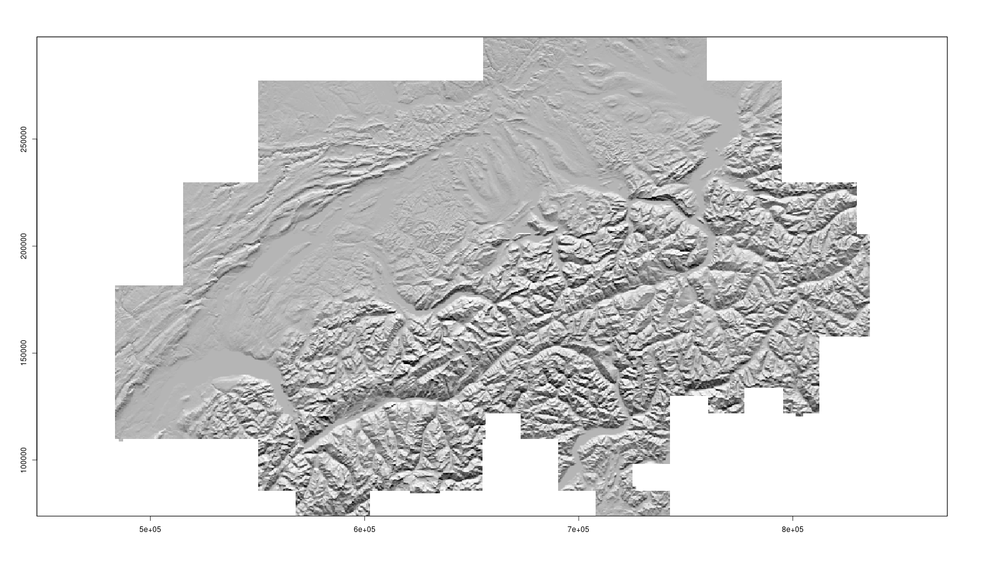
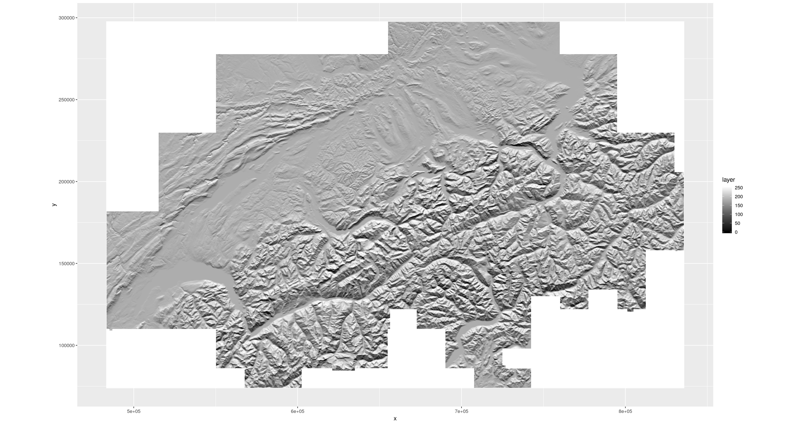
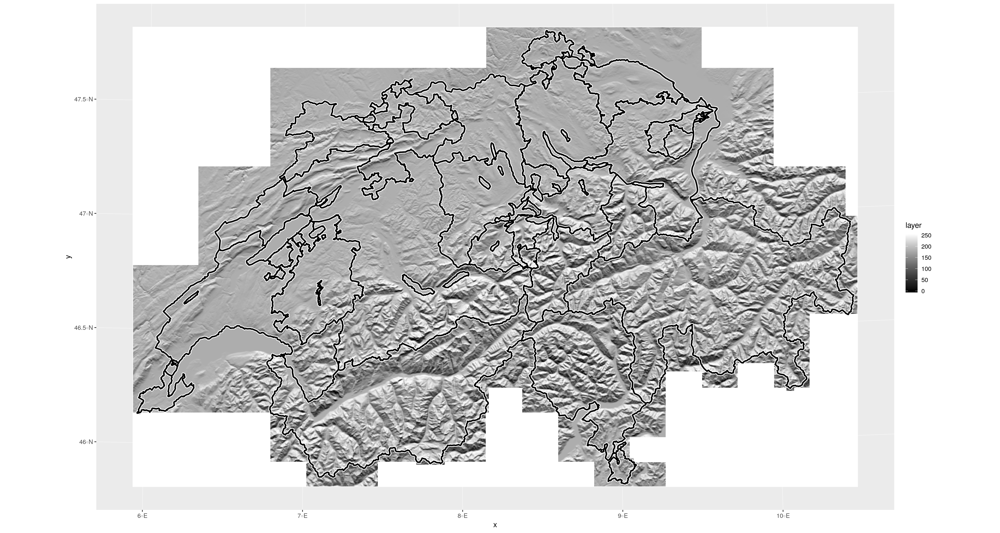
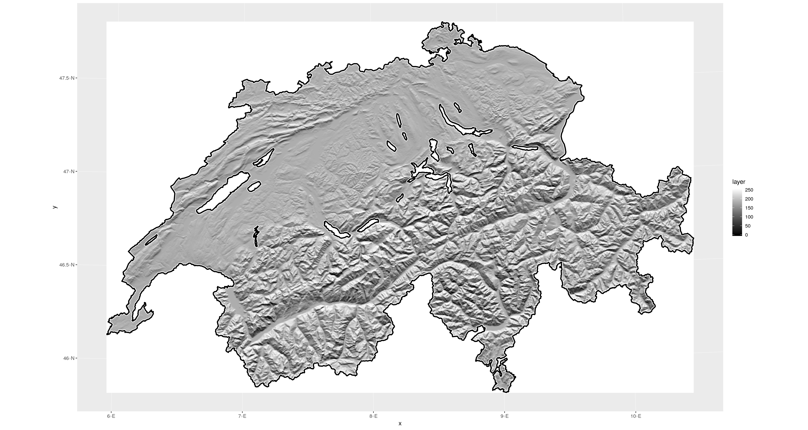
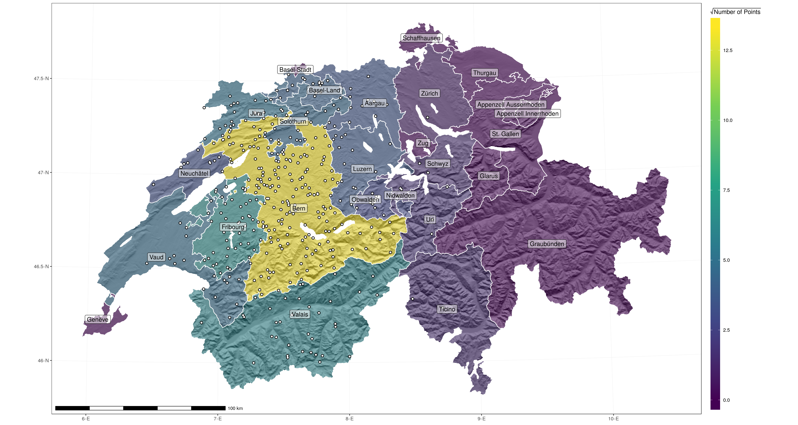

### Load the packages we will use:

```{r}
library(MASS)
library(tidyverse)
library(sf)
library(stars)
library(ggspatial)
```

### Load the Digital Elevation Model

```{r}
DEM.250.rast <- raster::raster(x =  '~/DEM_250.tif')

DEM.250.rast
```

```{r}
class       : RasterLayer 
dimensions  : 896, 1411, 1264256  (nrow, ncol, ncell)
resolution  : 250, 250  (x, y)
extent      : 483187.5, 835937.5, 73787.5, 297787.5  (xmin, xmax, ymin, ymax)
coord. ref. : +proj=somerc +lat_0=46.95240555555556 +lon_0=7.439583333333333 +k_0=1 +x_0=600000 +y_0=200000 +ellps=bessel +towgs84=674.4,15.1,405.3,0,0,0,0 +units=m +no_defs 
data source : ~/DEM_250.tif 
names       : DEM_250 
values      : 193, 4531.396  (min, max)
```

### Calculate a hill shaded terrain surface

```{r}
Slope.rast <- raster::terrain(x = DEM.250.rast, opt = 'slope')

Aspect.rast <- raster::terrain(x = DEM.250.rast, opt = 'aspect')

HS.rast <- raster::hillShade(slope = Slope.rast, aspect = Aspect.rast, normalize = TRUE)

raster::plot(HS.rast, col=grey(0:100/100), legend=FALSE)
```



### Convert the hill shaded terrain surface from an object of class `raster` to an object of class `stars`

```{r}
HS.stars <- st_as_stars(.x = HS.rast)
```

### Read in the cantonal boundaries as a simple features `sf` object

```{r}
canton.sf <- read_sf('~/Kantone.shp')
```

### Check both objects use the same coordinate reference system

```{r}
st_crs(HS.stars) == st_crs(canton.sf)
```

```{r}
[1] FALSE
```

```{r}
st_crs(HS.stars)
```

```{r}
Coordinate Reference System:
  No EPSG code
  proj4string: "+proj=somerc +lat_0=46.95240555555556 +lon_0=7.439583333333333 +k_0=1 +x_0=600000 +y_0=200000 +ellps=bessel +towgs84=674.4,15.1,405.3,0,0,0,0 +units=m +no_defs"
```

```{r}
st_crs(canton.sf)
```

```{r}
Coordinate Reference System:
  No EPSG code
  proj4string: "+proj=somerc +lat_0=46.95240555555556 +lon_0=7.439583333333333 +k_0=1 +x_0=600000 +y_0=200000 +ellps=bessel +units=m +no_defs"
```

### Reproject the cantonal boundaries to the coordinate reference system of the hill shaded terrain surface

```{r}
canton.sf <- st_transform(x = canton.sf, crs = st_crs(HS.stars))

st_crs(HS.stars) == st_crs(canton.sf)
```

```{r}
[1] TRUE
```


### Plot the hill shaded terrain surface with `ggplot2`

```{r}
p1 <- ggplot() +
  geom_stars(data = HS.stars) + 
  scale_fill_gradient(low = 'black', high = 'white', na.value = 'white') +
  coord_equal()

p1
```



### Add the cantonal boundaries to the plot of the hill shaded terrain surface

```{r}
p2 <- p1 +
  geom_sf(data = canton.sf, fill = NA, size = 2, colour = 'white') +
  geom_sf(data = canton.sf, fill = NA, size = 1, colour = 'black')

p2
```



### Find the union of the cantonal boundary polygons

```{r}
border.sf <- st_union(x = canton.sf) 
```

### Add the union of the cantonal boundary polygons to the plot of the hill shaded terrain surface

```{r}
p3 <- p1 +
  geom_sf(data = border.sf, fill = NA, size = 2, colour = 'white') +
  geom_sf(data = border.sf, fill = NA, size = 1, colour = 'black')

p3
```


### Crop the hill shaded terrain surface to the union of the cantonal boundary polygons

```{r}
CH.HS.stars <- st_crop(x = HS.stars, y = border.sf)
```

### Plot this cropped hill shaded terrain surface

```{r}
p4 <- ggplot() +
  geom_stars(data = CH.HS.stars) + 
  scale_fill_gradient(low = 'black', high = 'white', na.value = 'white') +
  coord_equal() +
  geom_sf(data = border.sf, fill = NA, size = 2, colour = 'white') +
  geom_sf(data = border.sf, fill = NA, size = 1, colour = 'black')

p4
```




### Now suppose we wanted to overlay some spatial points data, for this example I simulate some such data

```{r}
mvn.pts.sf <- mvrnorm(n = 500, mu = c(7.4474, 46.9480), Sigma = diag(x = 0.2, nrow = 2)) %>%
  as_tibble() %>%
    rename(X = V1, Y = V2) %>%
      st_as_sf(x = .,
               coords = c('X', 'Y'),
               crs = 4326
      ) %>%
        st_transform(crs = st_crs(CH.HS.stars))
```

### Determine which canton each point intersects

```{r}
points.in.cantons.sf <- st_intersection(x = mvn.pts.sf, y = canton.sf)
```

### Count the number of points within each canton

```{r}
n.pts.tb <- group_by(points.in.cantons.sf, Name) %>%
  count() %>%
    arrange(desc(n)) %>%
      as_tibble() %>% 
        dplyr::select(Name, n)
```

### Add these counts to a simple features object containing the cantonal boundaries

```{r}
canton.npts.sf <- left_join(x = canton.sf, y = n.pts.tb, by = 'Name') %>%
  mutate(n.pts = case_when( is.na(n) ~ as.integer(0),
                           !is.na(n) ~ n
                 )
  )
```

### Produce a more complex plot...

```{r}
p5 <- ggplot() +
  geom_stars(data = CH.HS.stars, aes(x = x, y = y, alpha = -layer), fill = 'black') + 
  scale_alpha_continuous(na.value = 0) +  
  geom_sf(data = canton.npts.sf, aes(fill = sqrt(n.pts)), alpha = 0.5, colour = 'white') +
  geom_sf(data = points.in.cantons.sf, size = 2) +
  geom_sf(data = points.in.cantons.sf, size = 1, colour = 'white') +
  scale_fill_viridis_c() +
  geom_sf_label(data = canton.sf, aes(label = Name), alpha = 0.5, fill = 'white') +
  annotation_scale(width_hint = 0.3) +
  guides(alpha = FALSE) +
  labs(x = NULL, y = NULL, fill = expression(sqrt(paste('Number of Points')))) +
  theme_bw() +
  theme(legend.key.height = unit(x = 5, units = 'cm'))

p5
```




### References

Learn more about `stars` and `sf` [here.](https://www.r-spatial.org/)

Learn more about the `tidyverse` (`dplyr`, `magrittr`, `ggplot2` etc.) [here.](https://www.tidyverse.org/)
